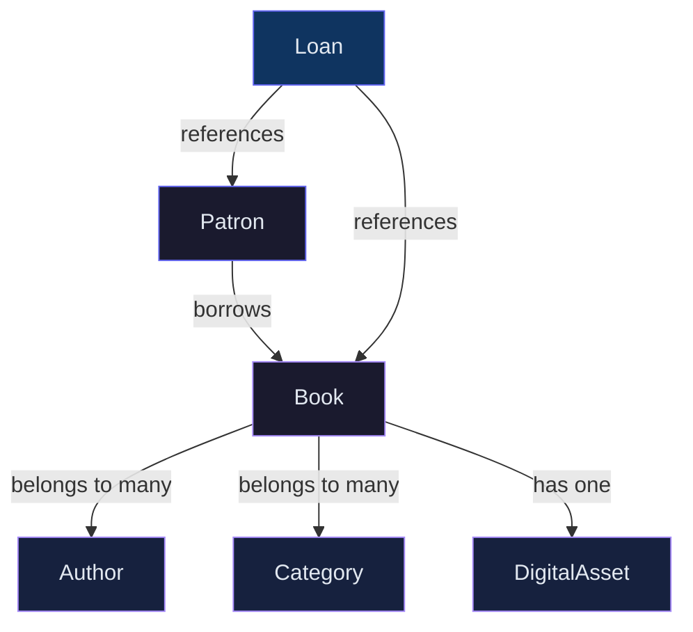
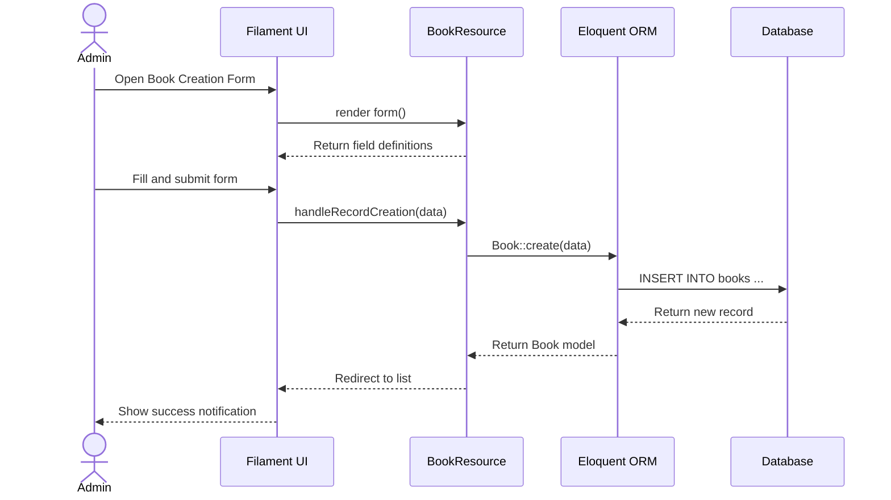
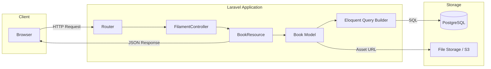
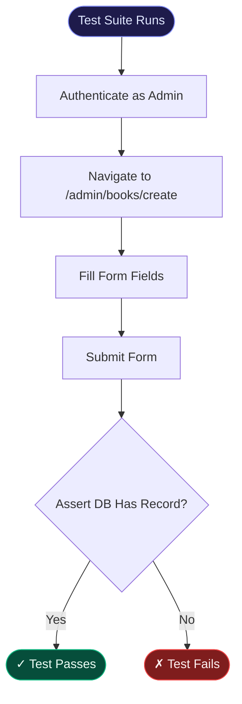

Building a sophisticated administrative interface doesn't have to be an exercise in tedious boilerplate. When tasked with creating a digital library management system, I needed a tool that prioritized rapid development without sacrificing technical elegance. Enter **Laravel Filament**. This post explores how I structured the underlying schema and leveraged Filament's powerful declarative UI to build a clean, minimalist dashboard.

The foundation of any scalable library is its data normalization, as detailed in the [Filament documentation](https://filamentphp.com/docs).

## Architecting the Database Schema

A solid foundation requires a precise schema. For a digital library, the relationships are deceptively complex. We need to model books, authors, categories, and patrons — all with their many-to-many associations. Here's the high-level entity relationship:

Each `Book` record stores minimal metadata — title, ISBN, publication year — while delegating physical or digital asset storage to a dedicated `DigitalAsset` model with a polymorphic relationship. This keeps the core schema clean and extensible.

## Designing the Filament Resource

Configuring the Filament resource is where the magic happens. By defining the `form` and `table` schemas declaratively, we can generate a complete CRUD interface with a few lines of PHP.

The declarative approach means you're spending your time on *what* the form should do, not *how* it should render. Fields like `TextInput`, `Select`, and `FileUpload` handle their own validation, casting, and relationships.

## The Data Flow Architecture

Understanding how data moves through the system helps when debugging or extending functionality:

## Testing the Implementation

Testing is a crucial phase. For a Filament admin panel, we focus on feature tests that simulate user interactions within the dashboard. Livewire's testing utilities make this remarkably straightforward.

A typical test flow for the Book resource looks like this:

The key insight is that Filament's testing utilities integrate seamlessly with Laravel's existing HTTP testing layer. You're not testing a black box — you're testing standard Laravel controllers under the hood.

## Key Takeaways

Working with Filament on this project reinforced a few principles that apply beyond the specific framework:

- **Declarative over imperative**: defining *what* you want is almost always cleaner than specifying *how* to get it.
- **Convention reduces decision fatigue**: following Filament's conventions for resource naming and file organization meant fewer architectural decisions and a more predictable codebase.
- **Test at the right level**: feature tests that drive the actual UI are far more valuable for admin panels than isolated unit tests on individual helper methods.

The result is a clean, maintainable admin interface that can be extended or modified by any developer familiar with the conventions.
