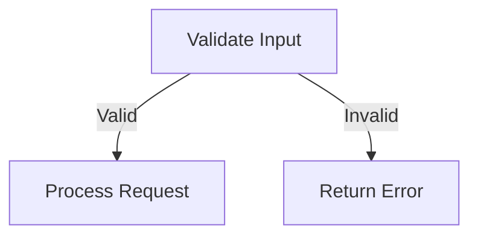
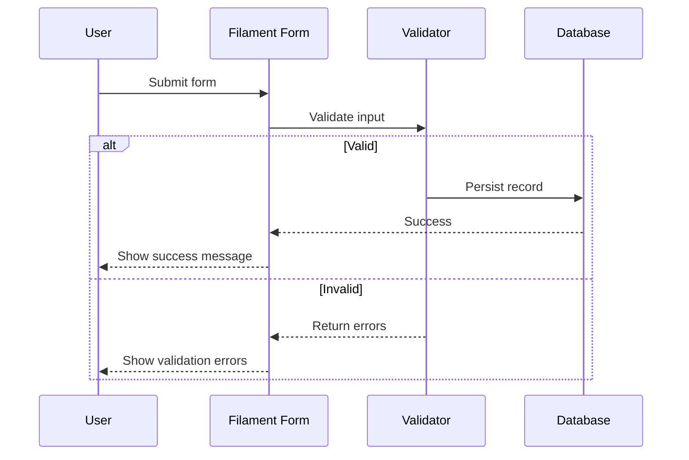

Building a sophisticated administrative interface doesn't have to be an exercise in tedious boilerplate. When tasked with creating a digital library management system, I needed a tool that prioritized rapid development without sacrificing technical elegance. Enter Laravel Filament. This post explores how I structured the underlying schema and leveraged Filament's powerful declarative UI to build a clean, minimalist dashboard.

The foundation of any scalable library is its data normalization, as detailed in the [Filament documentation](https://filamentphp.com/docs).

## Architecting the Database Schema

A solid foundation requires a precise schema. For a digital library, the relationships are deceptively complex. We need to handle books, authors, categories, and digital asset storage efficiently.

For instance, this is handled automatically via the `HasMedia` interface.

### Polymorphic Relationship Structures

1. Define a robust schema for media metadata.
2. Implement polymorphic relations for flexible categorization.
3. Optimize indexing for ISBN and author lookups.

Key features of this approach:

- **Polymorphic Relationships** — Implementing polymorphic relations for tags to allow categorization across books, authors, and series.
- **Efficient Media Storage** — Utilizing Spatie Media Library to handle cover images and EPUB file uploads seamlessly.
- **Optimized Indexing** — Strategic database indexing on ISBNs, author names, and publication dates for lightning-fast queries.

A nested list example:

- Backend concerns
  - Database schema design
  - API endpoint structure
  - Caching strategy
- Frontend concerns
  - Component architecture
  - State management
  - Accessibility

| Approach | Pros | Cons |
|---|---|---|
| Filament Core | Rapid development | Less flexible |
| Spatie Media Library | Rich features | External dependency |
| Custom Implementation | Full control | Time intensive |

> "Minimalism is not the absence of things, but the perfect amount of them."

Configuring the Filament resource is where the magic happens. By defining the form and table schemas declaratively, we can generate a complete CRUD interface with a few lines of code.

```php
public static function form(Form $form): Form
{
    return $form
        ->schema([
            Forms\Components\TextInput::make('title')
                ->required()
                ->maxLength(255),
            Forms\Components\Select::make('author_id')
                ->relationship('author', 'name')
                ->searchable()
                ->required(),
            Forms\Components\FileUpload::make('cover')
                ->image()
                ->directory('covers'),
        ]);
}
```


*Fig 1. Filament Resource Dashboard*

Here's how a request flows through the system:


*Fig 2. Request flow diagram*

By focusing on the structural integrity of the schema and letting Filament handle the UI scaffolding, we achieve a system that is both robust and visually refined. **The real power lies in the constraints** — choosing a toolset that enforces *good patterns while abstracting away the noise*, allowing us to focus purely on the architectural design of the application.

## Handling Data Validation

Validation logic determines whether a request proceeds normally or gets rejected early. Below is a more complex reference table covering common Filament field types:

| Field Type | Component | Validation | DB Type | Priority |
|---|---|---|---|---:|
| Text Input | `TextInput::make()` | required | string | 01 |
| Select Menu | `Select::make()` | exists | unsignedBigInt | 02 |
| File Upload | `FileUpload::make()` | image\|max:1024 | string | 03 |
| Rich Editor | `RichEditor::make()` | nullable | text | 04 |
| Date Picker | `DatePicker::make()` | date\|after:today | date | 05 |

The decision flow for validating input looks like this:



*Fig 3. Decision flow diagram*

## Testing the Implementation

Once the resource is built, writing tests ensures the CRUD operations and validation rules behave as expected under real conditions.

### Writing Feature Tests

Feature tests confirm that creating, updating, and deleting records through the Filament resource works end-to-end, including validation rules and relationships. This catches regressions early, especially when refactoring form schemas.

### Testing Edge Cases

Edge cases include submitting invalid file types, exceeding file size limits, and testing unique constraint violations on ISBN fields. These tests are just as important as the happy path.

```php
it('rejects a book with an invalid ISBN format', function () {
    $response = $this->post('/admin/books', [
        'title' => 'Sample Book',
        'isbn' => 'not-a-valid-isbn',
    ]);

    $response->assertSessionHasErrors('isbn');
});
```

A sequence of how a create request is validated end-to-end:



*Fig 4. Sequence diagram of the validation flow*

## Deployment Considerations

Before shipping this to production, a few things are worth double-checking: database indexing on frequently queried columns (ISBN, author, category), a caching strategy for read-heavy endpoints like the public catalog search, and making sure file storage (covers, EPUBs) is configured to use a proper disk driver — local storage works fine in development, but production usually calls for S3 or a similar object storage service.

---

By focusing on the structural integrity of the schema and letting Filament handle the UI scaffolding from day one, this project ended up being both maintainable and pleasant to extend. If you're building something similar, start with the schema — everything else follows from there.
