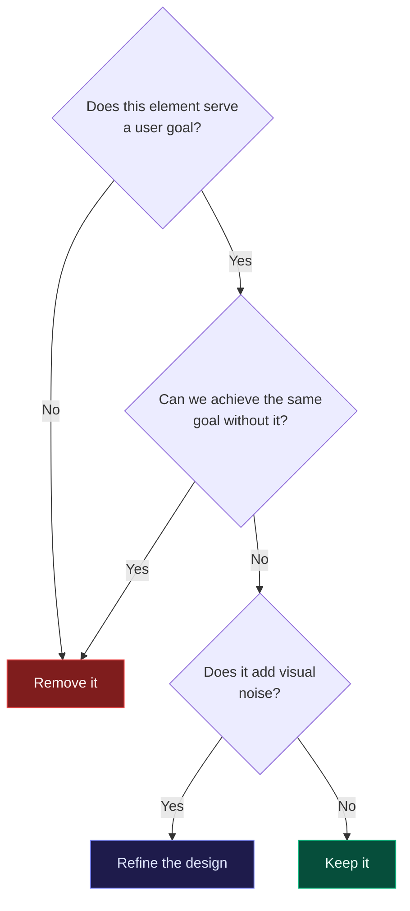

Minimal design is often misunderstood as "less work." In reality, achieving a truly minimal interface requires more thought, more iteration, and more restraint than piling on features.

## What Minimalism Actually Means

A minimal interface isn't one with few elements — it's one where every element serves a clear purpose. The challenge is knowing what to remove without sacrificing usability.

The decision-making process for any UI element can be mapped simply:

## Starting with User Goals

Before removing anything, understand what the user is trying to accomplish. Every design decision should map back to a specific user goal. If an element doesn't support a goal, it's a candidate for removal.

## Typography as Structure

In minimal design, typography does a lot of heavy lifting. Clear hierarchy through font weight, size, and spacing can replace visual clutter like borders, backgrounds, and decorative elements.

The principle is simple: if your layout requires a decorative element to explain itself, the layout has already failed.
