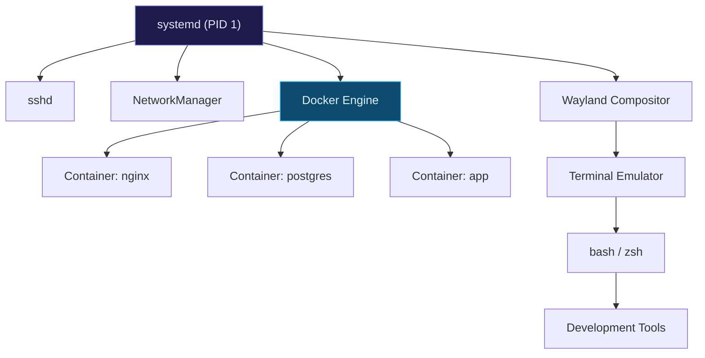

After years of working on different operating systems, I made the switch to Linux as my primary development environment. Here's why I haven't looked back.

## Control and Transparency

Linux gives you complete control over your system. Unlike proprietary operating systems, you can see exactly what's running, why it's running, and how to stop it. This transparency is invaluable when debugging complex issues.

A typical Linux process hierarchy looks something like this:

Every process has a traceable lineage. When something misbehaves, `ps`, `strace`, and `/proc` give you genuine insight rather than opaque error dialogs.

## The Terminal is a First-Class Citizen

Everything on Linux is designed to work beautifully from the command line. Package management, file operations, process management — all of it feels native and integrated.

## Performance and Resource Usage

A well-configured Linux system is remarkably lightweight. My development machine runs faster, cooler, and longer on battery than it did on any other OS.

## The Right Tool for the Job

Linux isn't for everyone, and that's fine. But for anyone spending significant time in a terminal, working with Docker containers, or self-hosting services, the friction cost of any other OS quickly becomes apparent.
